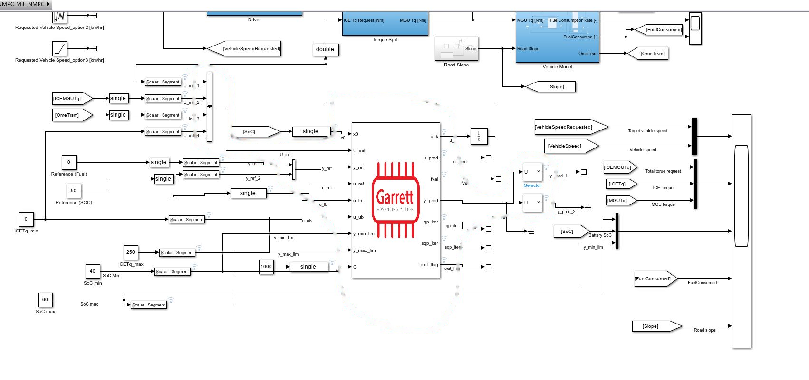
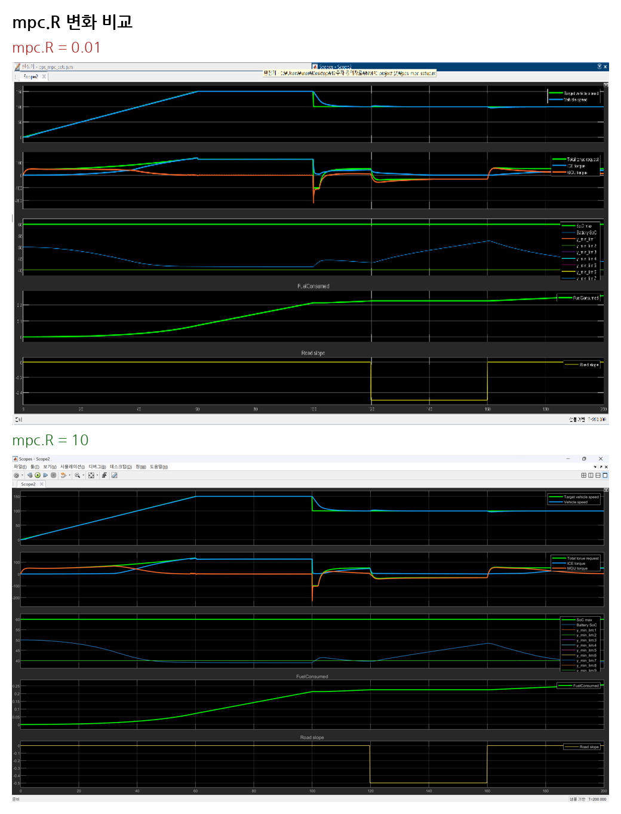
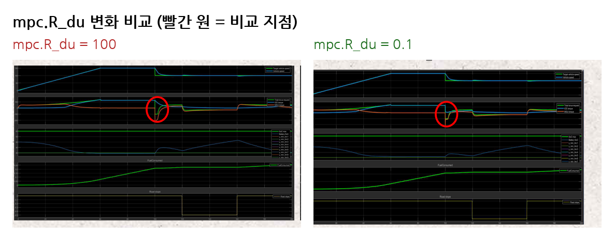
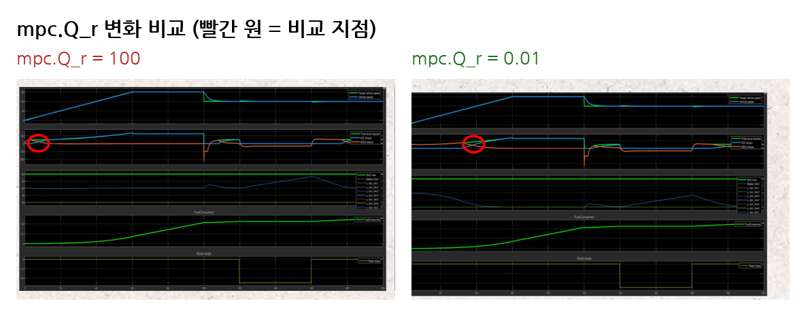
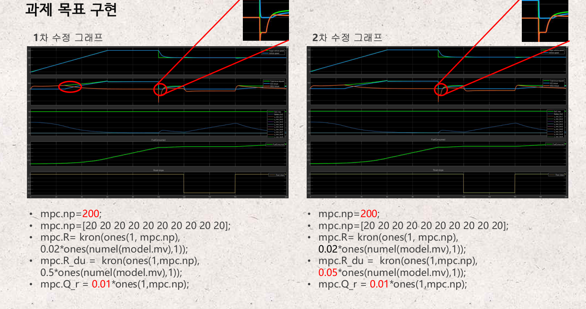
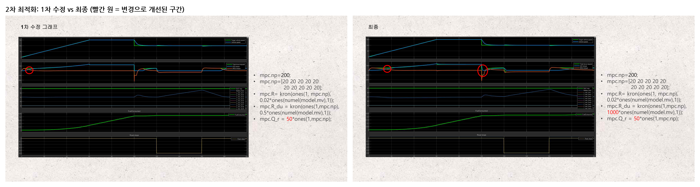

# NMPC 기반 하이브리드차 연료소비·SOC 최적화 시뮬레이션

**창업연계융합설계 (Garrett Motion 연계 프로젝트)**

Garrett Motion의 NMPC(Nonlinear Model Predictive Control) 프레임워크를 활용하여, 하이브리드 자동차의 엔진(ICE) 토크 제어와 배터리 SOC(State of Charge)·연료소비(FC)를 동시에 최적화하는 시뮬레이션 프로젝트입니다.

## 프로젝트 개요

- MATLAB/Simulink 기반 NMPC 컨트롤러의 파라미터를 튜닝하여 목표 성능 그래프에 근접시키는 것을 목표로 진행했습니다.
- 엔진 토크, 모터 토크, SOC, 연료소비량을 동시에 고려하는 비용함수 가중치를 조정하며 최적의 제어 응답을 탐색했습니다.

## 시스템 구조



Simulink 상의 NMPC 블록으로, 초기 상태(`U_init`, `x0`), 기준값(`y_ref`, `u_ref`), 제약 조건(`u_lb`/`u_ub`, `y_min_lim`/`y_max_lim`)을 입력받아 최적 제어입력(`u_k`, `u_pred`)과 예측 출력(`y_pred`), 비용함수 값(`fval`)을 산출하는 구조입니다.

시뮬레이션에 사용된 기본 설정값은 다음과 같습니다.

| 항목 | 값 | 연결 |
|---|---|---|
| Reference (Fuel) | 0 | `y_ref_1` |
| Reference (SOC) | 50 | `y_ref_2` |
| ICETq_min | 0 | `u_lb` |
| ICETq_max | 250 | `u_ub` |
| SoC min | 40 | `y_min_lim` |
| SoC max | 60 | `y_max_lim` |
| G (soft constraint 가중치) | 1000 | `G` |

## 주요 MPC 파라미터

| 파라미터 | 설명 |
|---|---|
| `mpc.np` | 예측구간 (Prediction Horizon) |
| `mpc.blocks` | 제어변수 블록 길이 (MV Block length) |
| `mpc.nc` | 제어구간 (Control Horizon) |
| `mpc.R` | 제어 크기 가중치 |
| `mpc.R_du` | 제어 증분 가중치 (제어 경로의 완만함 조절) |
| `mpc.Q_r` | 출력 기준값 추종 가중치 |
| `mpc.Q_r_lin` | 출력 기준 추적 선형 비용 가중치 |
| `mpc.G` | 소프트 제한(soft constraint) 위반 패널티 가중치 |

## 파라미터별 실험 결과

**mpc.R** — 값이 클수록 SOC가 급격히 감소하고, 입력(input) 비중이 낮아집니다.



**mpc.R_du** — 값이 클수록 제어 경로가 완만해집니다(제어 궤적을 부드럽게 만듦). 빨간 원으로 표시된 지점이 값에 따라 토크 응답이 어떻게 달라지는지 보여주는 비교 구간입니다.



**mpc.Q_r** — 값이 클수록 그래프 교차점이 왼쪽으로 이동하고, 모터 사용이 감소합니다. 마찬가지로 빨간 원 구간에서 초기 토크 배분이 달라지는 것을 확인할 수 있습니다.



그 외 `mpc.blocks`는 상태가 급격히 변하는 구간은 블록을 작게, 변화가 적은 구간은 크게 설정하여 최적화 효율을 높였고, `mpc.G`는 1000으로 고정 시 안정적인 SOC 제한을 유지했으며(값이 작을수록 SOC 사용 증가), `mpc.Q_r_lin`은 0→1로 변경해도 결과에 유의미한 차이가 없었습니다.

## 1차: 과제 목표 구현

먼저 과제에서 주어진 목표 응답 패턴을 재현하는 것을 1차 목표로 삼아, `R_du`를 낮춰가며(0.5 → 0.05) 제어 궤적을 목표에 가깝게 맞췄습니다. 빨간 원과 확대 표시가 두 그래프에서 토크 응답이 달라지는 구간을 나타냅니다.



## 2차: 배경 조사 기반 최적화 목표 수립

1차 구현 이후, 단순히 주어진 그래프를 재현하는 데 그치지 않고 실제로 연비를 개선할 수 있는 근거를 마련하기 위해 배경 조사를 진행했습니다.

- **하이브리드차 작동원리**: 모터 단독 구동, 엔진+모터 병행 구동, 회생제동 충전 등 주행 상황별 동력 배분 구조를 조사 (출처: 현대자동차 테크, 아마존카)
- **현대자동차 기술 연구자료**: 리튬이온 배터리는 SOC 50~80% 부근에서 내부 저항이 가장 낮고, 배터리 전력을 절반 안팎으로 사용할 때 효율이 가장 높다는 내용을 확인 (출처: [현대자동차 스토리](https://www.hyundai.co.kr/story/CONT0000000000084685))
- **학술 논문**: 김광일, 권해붕, 이현우, 임종순, 신영복, 「하이브리드자동차의 연료소비율 시험 시 초기 SOC와 측정결과에 대한 실험적 연구」. 논문에서는 실차 주행 실험 결과 SOC가 약 50~55% 구간에서 제어될 때 연비 편차가 가장 적고 안정적이라는 결과를 제시함
- **특허 KR100460878B1** (현대자동차, 하이브리드 전기 자동차의 배터리 충전 상태 관리방법): SOC 상태를 구간별로 세분화하여 배터리 수명과 연비 효율을 함께 관리하는 방법을 제시

이 조사를 근거로, **SOC를 40~60% 제한 구간 내에서 50% 안팎으로 유지하는 것**을 최적화 목표로 설정하고, `mpc.Q_r`을 0.01 → 50으로 크게 높여 SOC 추종을 강화하는 방향으로 파라미터를 재설계했습니다. 아래는 1차 수정(`R_du=0.5`)과 최종(`R_du=1000`) 결과 비교이며, 빨간 원으로 표시된 두 지점에서 토크 응답이 개선된 것을 확인할 수 있습니다.

```matlab
mpc.np = 200;
mpc.blocks = [20 20 20 20 20 20 20 20 20 20];
mpc.R = kron(ones(1, mpc.np), 0.02*ones(numel(model.mv),1));
mpc.R_du = kron(ones(1, mpc.np), 1000*ones(numel(model.mv),1));
mpc.Q_r = 50*ones(1, mpc.np);
```



- 연료소비량: **0.28L → 0.23L**로 절감
- 배터리 SOC를 목표 제한 구간(40~60%) 내에서 안정적으로 수렴시킴

## 참고문헌

- 김광일, 권해붕, 이현우, 임종순, 신영복, 「하이브리드자동차의 연료소비율 시험 시 초기 SOC와 측정결과에 대한 실험적 연구」
- 특허 KR100460878B1, 「하이브리드 전기 자동차의 배터리 충전 상태 관리방법」, 현대자동차
- [현대자동차 스토리 - 배터리 SOC와 연비 효율](https://www.hyundai.co.kr/story/CONT0000000000084685)
- 본 프로젝트는 Garrett Motion에서 제공한 NMPC Framework를 기반으로 진행되었습니다.
