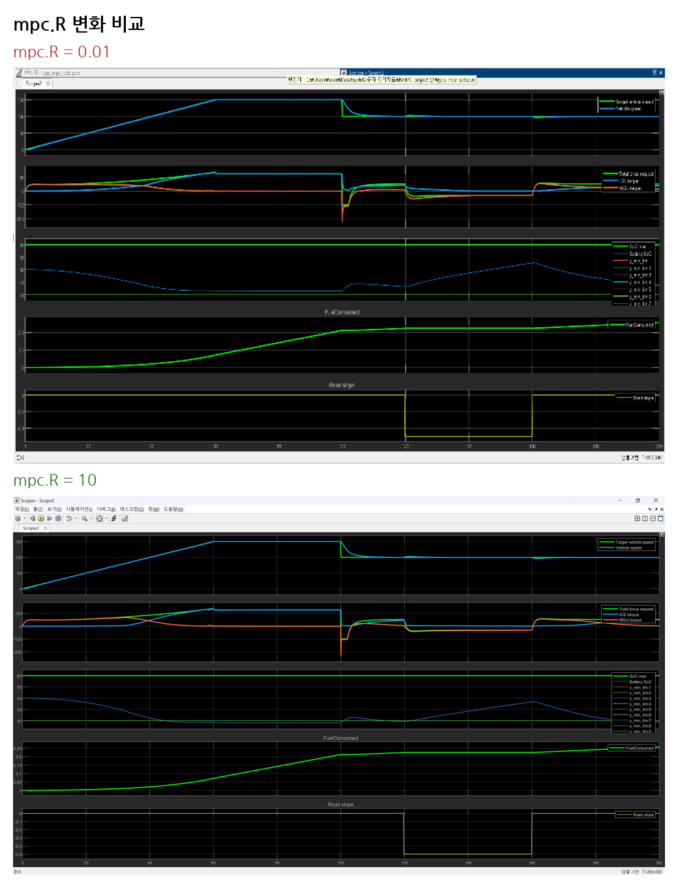
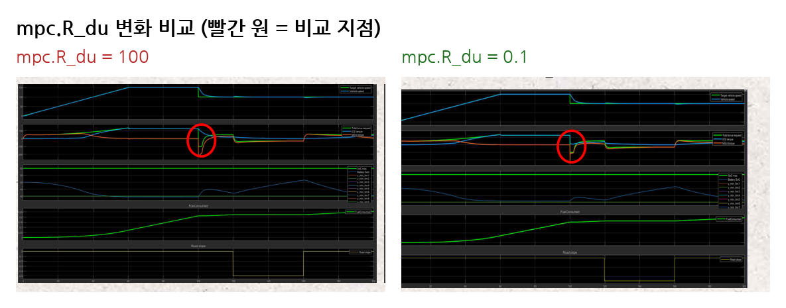
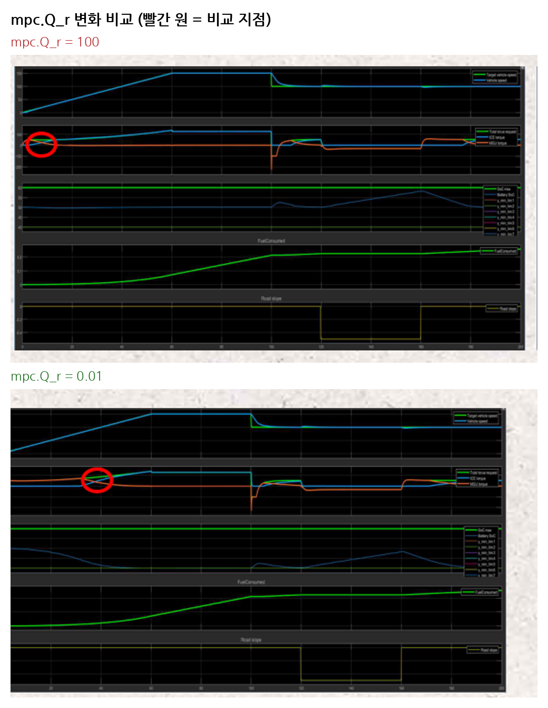
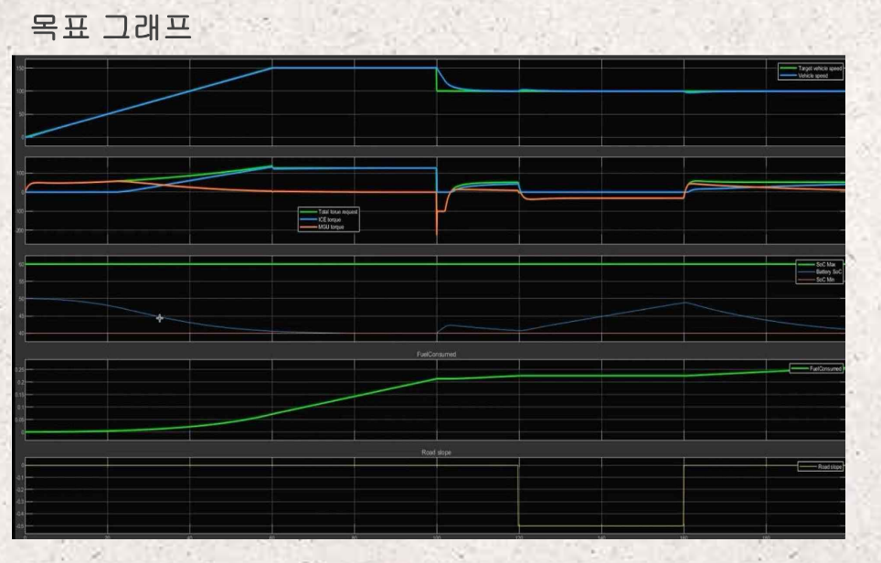
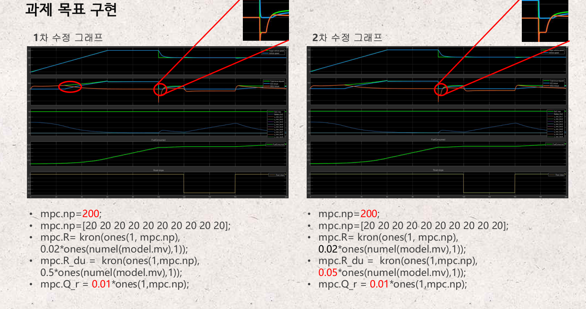
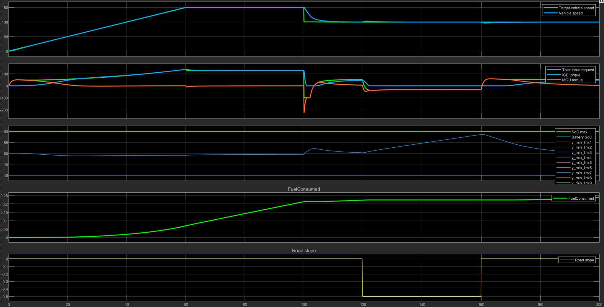

# NMPC 기반 하이브리드차 연료소비·SOC 최적화 시뮬레이션

**창업연계융합설계 (Garrett Motion 연계 프로젝트) · Garrett Motion Korea 경진대회 2위**

Garrett Motion이 제공한 NMPC(Nonlinear Model Predictive Control) 프레임워크와 MATLAB/Simulink 차량 모델을 활용해 엔진(ICE)과 모터(MGU)의 동력 분배를 조정한 프로젝트입니다. 먼저 제공된 목표 그래프의 제어 응답을 재현하고, 이후 같은 주행 조건에서 누적 연료 소비(FC)와 배터리 충전 상태(SOC)를 비교하며 파라미터를 조정했습니다.

## 프로젝트 개요

- **환경:** MATLAB/Simulink, Garrett Motion 제공 차량 모델 및 NMPC 프레임워크
- **진행:** 제공된 목표 응답 재현 → 파라미터별 영향 분석 → FC·SOC 최적화
- **담당:** NMPC 파라미터 분석 및 튜닝, 엔진·모터 토크와 FC·SOC 결과 비교
- **결과:** 제공된 목표 그래프 대비 누적 연료 소비 약 0.28 L → 약 0.23 L(그래프 눈금 기준 추정, 약 18% 감소), 최종 주행 중 SOC 대체로 50~60% 유지

## 시스템 구조

Simulink의 NMPC 블록은 초기 상태(`U_init`, `x0`), 기준값(`y_ref`, `u_ref`), 입력·출력 제약 조건(`u_lb`/`u_ub`, `y_min_lim`/`y_max_lim`)을 받아 제어입력(`u_k`, `u_pred`), 예측 출력(`y_pred`), 비용함수 값(`fval`)을 계산합니다. NMPC 블록 자체는 Garrett Motion에서 제공한 프레임워크이므로 내부 다이어그램은 게시하지 않았습니다.

시뮬레이션의 기본 설정은 다음과 같습니다.

| 항목 | 값 | 연결 |
|---|---:|---|
| Reference (Fuel) | 0 | `y_ref_1` |
| Reference (SOC) | 50 | `y_ref_2` |
| ICETq_min | 0 | `u_lb` |
| ICETq_max | 250 | `u_ub` |
| SoC min | 40 | `y_min_lim` |
| SoC max | 60 | `y_max_lim` |
| G (soft constraint 가중치) | 1000 | `G` |

## 주요 NMPC 파라미터

| 파라미터 | 역할 |
|---|---|
| `mpc.np` | 미래 상태를 예측하는 구간 |
| `mpc.blocks` | 제어변수의 블록 길이 |
| `mpc.nc` | 제어구간 |
| `mpc.R` | 제어입력 크기 가중치 |
| `mpc.R_du` | 제어입력 변화량 가중치 |
| `mpc.Q_r` | 출력 기준값 추종 가중치 |
| `mpc.Q_r_lin` | 출력 기준값 추종의 선형 비용 가중치 |
| `mpc.G` | 소프트 제약 위반 가중치 |

## 파라미터별 실험

`R`, `R_du`, `Q_r`, `G` 등의 값을 바꾸면서 속도 추종, 엔진·모터 토크, SOC, 누적 연료 소비가 어떻게 달라지는지 비교했습니다. 아래 그림의 빨간 원은 각 파라미터에 따른 토크 응답 차이를 살펴본 구간입니다.

**`mpc.R` — 제어입력 크기 가중치**

실험한 값에 따라 입력 사용 비중과 SOC 변화가 달라지는 것을 확인했습니다.



**`mpc.R_du` — 제어입력 변화량 가중치**

값을 높일수록 제어입력 변화가 완만해졌으며, 엔진과 모터의 토크 전환 구간을 비교했습니다.



**`mpc.Q_r` — 출력 기준값 추종 가중치**

값을 바꿔 SOC와 초기 토크 분배의 변화를 확인했습니다.



`mpc.blocks`는 구간별 블록 길이를 설정했고, `mpc.G`는 1000으로 유지했습니다. `mpc.Q_r_lin`을 0에서 1로 바꾼 실험에서는 결과에 뚜렷한 차이가 나타나지 않았습니다.

## 1차: 제공된 목표 응답 재현

먼저 제공된 목표 그래프를 비교 대상으로 두고, `R_du`를 조정하면서 속도, 엔진·모터 토크 전환 시점, SOC, 누적 연료 소비를 비교했습니다. 이 단계의 목적은 제공된 제어 응답에 가까운 결과를 만드는 것이었습니다.

**비교 대상 | 제공된 목표 그래프**



**1차 구현 | 목표 응답과의 비교**

아래 비교 그림의 빨간 원과 확대 영역은 토크 응답 차이를 확인한 구간입니다.



## 2차: 연료 소비와 SOC 최적화

1차 목표 응답을 재현한 뒤, 목표 속도와 도로 경사 조건을 동일하게 두고 FC와 SOC를 함께 비교했습니다. 참고 자료를 검토해 SOC를 제한 범위(40~60%) 안에서 50~60% 부근으로 유지하는 기준을 정했습니다.

`Q_r=50`을 유지하고 `R_du`를 0.5 → 500 → 1000으로 변경하며 엔진·모터 토크, SOC, 누적 연료 소비의 변화를 확인했습니다. 최종 설정은 다음과 같습니다.

```matlab
mpc.np = 200;
mpc.blocks = [20 20 20 20 20 20 20 20 20 20];
mpc.R = kron(ones(1, mpc.np), 0.02*ones(numel(model.mv),1));
mpc.R_du = kron(ones(1, mpc.np), 1000*ones(numel(model.mv),1));
mpc.Q_r = 50*ones(1, mpc.np);
```

**최종 결과 | NMPC 파라미터 최적화**



- **누적 연료 소비:** 제공된 목표 그래프의 약 0.28 L에서 최종 결과 약 0.23 L로 감소(그래프 눈금 기준 추정, 약 18%)
- **SOC:** 제공된 그래프에서는 주행 중 약 40% 부근까지 내려갔으며, 최종 결과에서는 대체로 50~60% 부근을 유지
- **성과:** Garrett Motion Korea 경진대회 2위

## 참고 자료

- 김광일, 권해붕, 이현우, 임종순, 신영복, 「하이브리드자동차의 연료소비율 시험 시 초기 SOC와 측정결과에 대한 실험적 연구」
- 특허 KR100460878B1, 「하이브리드 전기 자동차의 배터리 충전 상태 관리방법」, 현대자동차
- [현대자동차 스토리: 배터리 SOC와 연비 효율](https://www.hyundai.co.kr/story/CONT0000000000084685)
- 본 프로젝트는 Garrett Motion이 제공한 NMPC Framework를 기반으로 진행했습니다.
